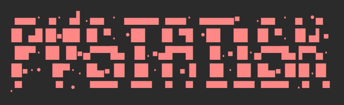

## PyStatisk

Markdown posts need to be in a Year/Month/Day (`YYYY/MM/DD`) structure inside a root `posts/` directory:
<pre style="font-family: monospace;">
|- _template.html  
|- posts/  
    |- 2020/  
        |- 01/ 
            |-20/ 
                |- index.md   
                |- picture.png  
            |-15/ 
                |- index.md
    |- 2019/  
        |- 12/    
            |-24/ 
                |- index.md
                |- pictureA.png 
                |- pictureB.png 
</pre> 